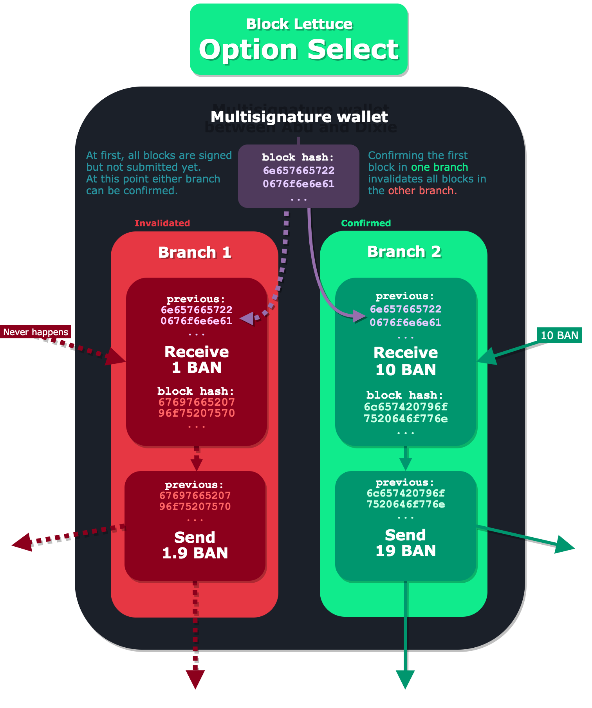

# Block Lettuce - Option Select

An algorithm for creating branching paths of blocks on Block Lettuce.

Using Option Select you can build useful things, such as a BAN/BAN vending machine, trustless BAN/BAN atomic swaps, an Escrow Agreement, or a mixer.

Several blocks are co-signed with the same `previous` block hash in a multisignature wallet. When one of those blocks is confirmed, the other blocks are invalidated.

## Table of Contents

* [Algorithm](#algorithm)
  1. [Derive multisignature wallet address](#derive-multisignature-wallet-address)
  2. [Establish off-chain messaging](#establish-off-chain-messaging)
  3. [Generate blocks](#generate-blocks)
  4. [Sign and verify blocks](#sign-and-verify-blocks)
  5. [Submit blocks to Banano nodes](#submit-blocks-to-banano-nodes)
* [Risks](#risks)
* [Related tools](#related-tools)

## Algorithm

### Derive multisignature wallet address

See [Related tools](#related-tools) for deriving and using multisignature wallets.

### Establish off-chain messaging

1) The two parties share their Curve25519 public keys by encoding it into change rep messages in their wallet.

2) Using ECDH they derive a shared secret.

3) They establish a connection in an off-chain message system encrypted with the shared secret.

### Generate blocks

On Banano blocks have a `previous` field set to the block hash of the previous block.

By generating multiple blocks with `previous` set to the same block hash, only one of those blocks can be confirmed.

Send blocks from your own account has to be generated in advance and should be kept secret.

All branches of the send and receive blocks for the multisignature wallet are generated and shared.

### Sign and verify blocks

Sign all blocks for the multisignature wallet.

Signing receive blocks makes branches that can only be confirmed after a specific party send BAN.

### Submit blocks to Banano nodes

Keep submitting any of the pre-signed blocks to the Banano network where the `previous` block hash matches the current confirmed frontier.

## Risks

### One party's account change frontier

If the Option Select relies on one party sending BAN to the multisignature wallet then it's important to ensure that party doesn't automatically receive any transactions during the Option Select.

A receive block will change the block hash for the frontier of the account, invalidating the send/receive to the multisignature account.

### Missing blocks for receiving in branches

When designing algorithms using Option Select you have to be careful to include receive blocks in all branches.

Otherwise you might send BAN to the multisignature wallet, and before the send is confirmed, a new branch is confirmed on the multisignature wallet.

If there's no pre-signed receive block for that branch, you have to rely on the other party signing blocks trustfully since now you can't verify the blocks before sending.

### Losing signed blocks

If you lose the signed blocks you have to rely on the other party sharing them with you again or signing new blocks.

## Related tools

Browser Multi-Signature tool:
https://tools.nanos.cc/?tool=multisig&parties=2

Browser source code:
https://github.com/Joohansson/keytools/blob/master/src/tools/MultisigTool.js

musig-nano in rust:
https://github.com/PlasmaPower/musig-nano

## See also

Nano Protocol Design - Blocks
https://docs.nano.org/protocol-design/blocks/
